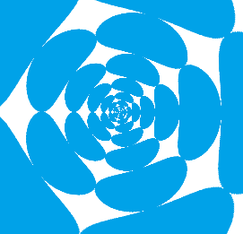

# Texture Extrusion

A simple texture extrusion shader made using Polar Coordinates.

It scrolls a texture either inwards or outwards and rotates it over time.
Also supports a gradient textures that tints the texture and can scroll inward or outward as well.

# Usage

Requires
	Scroll Texture
	Gradient Ramp (Optional)

# Example

### A simple scrolling texture with no gradient

# Consider buying me a coffee if you like my work (click the image)

